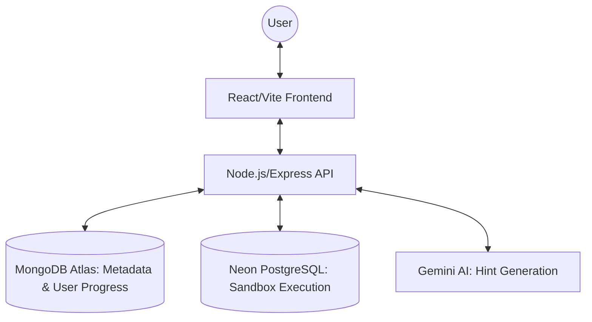

# CipherSQLStudio 🚀

CipherSQLStudio is a premium, full-stack SQL learning playground designed for students to master database queries through interactive challenges, real-time execution, and AI-powered feedback.

## 🏗️ System Architecture

CipherSQLStudio follows a modern decoupled architecture, ensuring scalability and security.



### Key Components:
1.  **Frontend (React/TypeScript)**: A mobile-first, responsive SPA using Monaco Editor for a VS Code-like SQL experience.
2.  **Backend (Node.js/Express)**: A robust REST API managing authentication, query validation, and external service orchestration.
3.  **Persistence Layer (MongoDB Atlas)**: Stores user profiles, hashed credentials, assignment metadata, and completion history.
4.  **Sandbox Layer (PostgreSQL)**: Executes student queries in isolated environments. Each assignment includes its own schema and sample data.
5.  **Intelligence Layer (Gemini AI)**: Analyzes user queries and provides non-spoilery, pedagogical hints.

---

## 🛠️ Technology Stack

### Frontend Internals
- **Framework**: [React 18](https://reactjs.org/)
- **Build Tool**: [Vite](https://vitejs.dev/)
- **Styling**: Vanilla **SCSS** following **BEM** (Block-Element-Modifier) conventions.
- **State Management**: React **Context API** (Auth) & specialized Hooks.
- **Code Editor**: [@monaco-editor/react](https://github.com/suren-atoyan/monaco-react)
- **Icons**: [Lucide React](https://lucide.dev/)

### Backend Internals
- **Environment**: [Node.js](https://nodejs.org/) & [TypeScript](https://www.typescriptlang.org/)
- **API Framework**: [Express.js](https://expressjs.com/)
- **Security**: [Helmet](https://helmetjs.github.io/), [CORS](https://github.com/expressjs/cors), [Express Rate Limit](https://github.com/n67/express-rate-limit).
- **Authentication**: Stateless [JWT](https://jwt.io/) with `bcryptjs` password hashing.
- **ORM/Drivers**: [Mongoose](https://mongoosejs.com/) (MongoDB) & [pg](https://node-postgres.com/) (PostgreSQL).

---

## 📂 Project Structure

### `/client` (Frontend)
- `src/components`: Reusable UI components (Navbar, Solver, ResultTable).
- `src/style`: SCSS architecture with `abstracts` (variables/mixins), `base`, and `components`.
- `src/context`: Global authentication state management.
- `src/utils`: Centralized API instance (Axios with interceptors).

### `/server` (Backend)
- `src/controllers`: Request handlers for Auth, Assignments, Queries, and Hints.
- `src/middleware`: Custom authentication and global error handling logic.
- `src/models`: Data definitions for Users and Assignments.
- `src/services`: Business logic for Sandbox management and AI interactions.
- `src/utils`: Database seeders and health checks.

---

## 🔒 Security & Sandbox Isolation

1.  **SQL Sanitization**: All incoming queries are checked against a blacklist to prevent destructive commands (`DROP`, `DELETE`, `TRUNCATE`, etc.).
2.  **Schema Isolation**: Every query execution is scoped to avoid cross-user interference.
3.  **JWT Protection**: Sensitive endpoints (`/execute`, `/hint`) require a valid Bearer token.
4.  **Rate Limiting**: Protects LLM and Database resources from abuse.

---

## 🚀 Setup & Installation

### Prerequisites
- Node.js (v18+)
- MongoDB Atlas Cluster
- PostgreSQL instance (e.g., Neon.tech)
- Gemini API Key

### Installation

1.  **Clone & Install**:
    ```bash
    git clone <url>
    cd og-schools
    # Install server dependencies
    cd server && npm install
    # Install client dependencies
    cd ../client && npm install
    ```

2.  **Environment Variables**:
    Create a `.env` in `/server` (see `.env.example`):
    - `MONGODB_URI`: Your MongoDB connection string.
    - `PG_URI`: Your PostgreSQL connection string.
    - `JWT_SECRET`: A long, random string.
    - `LLM_API_KEY`: Your Gemini/Google AI key.

3.  **Seed Database**:
    The server automatically seeds the MongoDB with sample assignments on the first startup.

4.  **Run Development Mode**:
    ```bash
    # In /server
    npm run dev
    # In /client
    npm run dev
    ```

---

## 🔌 API Summary

| End Point | Method | Description | Auth Required |
| :--- | :--- | :--- | :--- |
| `/api/auth/register` | `POST` | User registration | No |
| `/api/auth/login` | `POST` | User login / ID Token | No |
| `/api/assignments` | `GET` | Fetch all SQL challenges | No |
| `/api/assignments/:id` | `GET` | Detailed challenge data | No |
| `/api/execute` | `POST` | Run SQL query in sandbox | **Yes** |
| `/api/hint` | `POST` | Get AI tutor hint | **Yes** |

---

## 📜 License
Educational Project - © 2026 CipherSQL Team.
